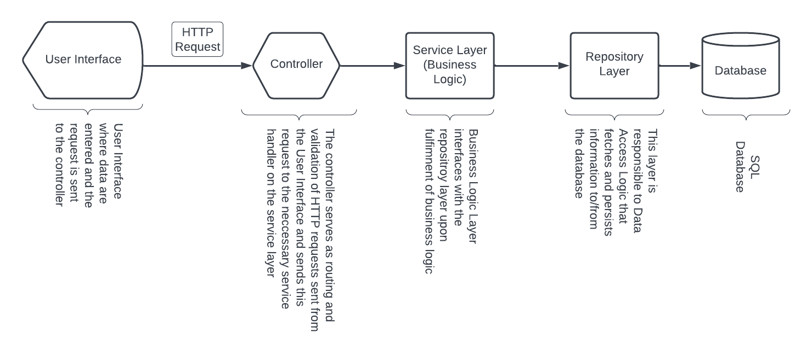
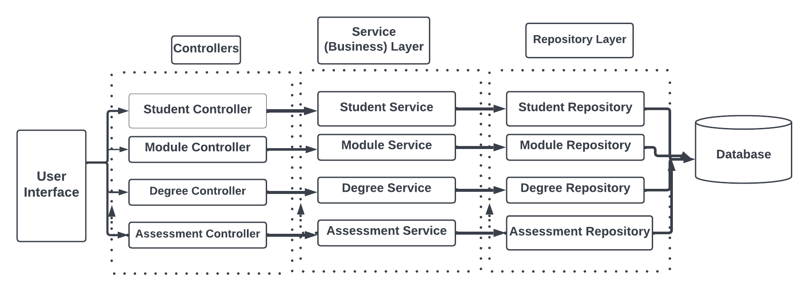
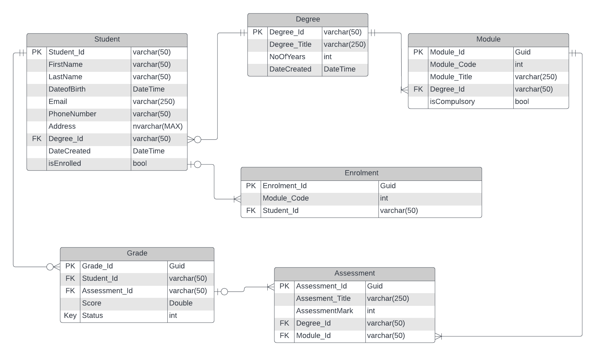

# StudentAdministrationERP
This is a Student Admin ERP System built on ASP.NET Core 3.1
Background
This project is a mini Enterprise Resource Planning (ERP) software that manages students’ administration processes and activities such as creating student profiles containing each student's information, enrolment of students to various degrees/programmes across different faculties, assigning modules and assessments to students, grading of assessments e.t.c. 

This project is only based on an Administrator's actions, i.e. Only the administrator's interface is available for this release.

Business Requirements
Below are the listed business requirements broken down for the project
Ability to create Students; The admin inputs student information such as First Name, Last Name, Email, Date of Birth, Phone number, Address and Choice of programme.
Students have a unique Student Id which starts with the Year of Cohort (i.e Year of Entry and a 6-digit number.
Ability to enrol students on modules associated with their choice of the degree program. 
Note: A student can only be enrolled to a degree and no two degree programs should offer the same module. A degree program must also contain a 6-digit program Identifier unique to each degree programme.
Admin can also create modules on the system and the module data such as Module code, Module Title and the degree programme associated with the module are entered into the system. Each Module should also have a 6-Digit Module Code unique to each module. The Admin can also select the option of Compulsory or Optional when creating a module.

Technologies
This project was built using C# and It targets ASP.NET Core 3.1 Framework.
This project was also built adopting the MVC Architecture pattern.
The Database provider used is the Microsoft SQL Server Database which is a Relational Database.
Entity Framework (EF) Core was used as the primary Object-Relational mapper to the Database entities. Also, AutoMapper was used to map data input from the user to the class entities.
LINQ was used to query the Database sets.
This project was implemented using the Repository Software Design Pattern.

PROJECT STRUCTURE DOCUMENTATION
The Project is structured into different folders, including the “Views” folder containing sub-folders of User Interface (Razor views) such as the Index.cshtml, GetStudents.cshtml and StudentDetails.cshtml for the Student subfolder. 
Also, the Module subfolder contains its view (user interface) files such as the index.cshtml. This also applies to the Assessment subfolder.
The Controller folder StudentController.cs, DegreeController.cs, AssessmentController.cs  and ModuleController.cs.
The Services folder houses all the business layer logic ( which acts as an intermediary layer between the Data-Access/Repository Layer and the Controller) it contains files such as DegreeService.cs, ModuleService.cs, AssessmentService.cs and StudentService.cs.
The Interfaces Folder contains all interface contracts used by the dependency injection to create instances for easy accessibility and flow of data to the service layer from the controller and to the repository layer from the service layer and vice versa. This folder contains IStudentRepo.cs, IStudentService.cs, IModuleService.cs, IModuleRepo.cs  e.t.c.
The project also contains the DTOs folder, which contains entity model classes representing data sent from the UI Layer.
The project also contains Models folder which contains classes i.e. entities that is a replica of the database entities.

ARCHITECTURE LAYER DESIGN

ENTITY RELATIONSHIP DIAGRAM (ERD)

The ERD depicts the Database (data storage) design, The relationship between the database entities such as One-Many relationship, etc. The ERD relationship below can be interpreted as follows: 
A student can only be registered, to one and only one degree and a degree program can contain zero or many Student(s).
A Degree programme contains one or many many modules and a module can only be assigned to one and only one degree programme
A Module can contain one or many Assessments and an assessment can only be assigned to one and only one module
A Student can have zero or many grades and a grade is assigned to one and only one student.
A student can be enrolled on one or many modules (Enrolment entity table) and an enrolment record is assigned to one and only one student.
